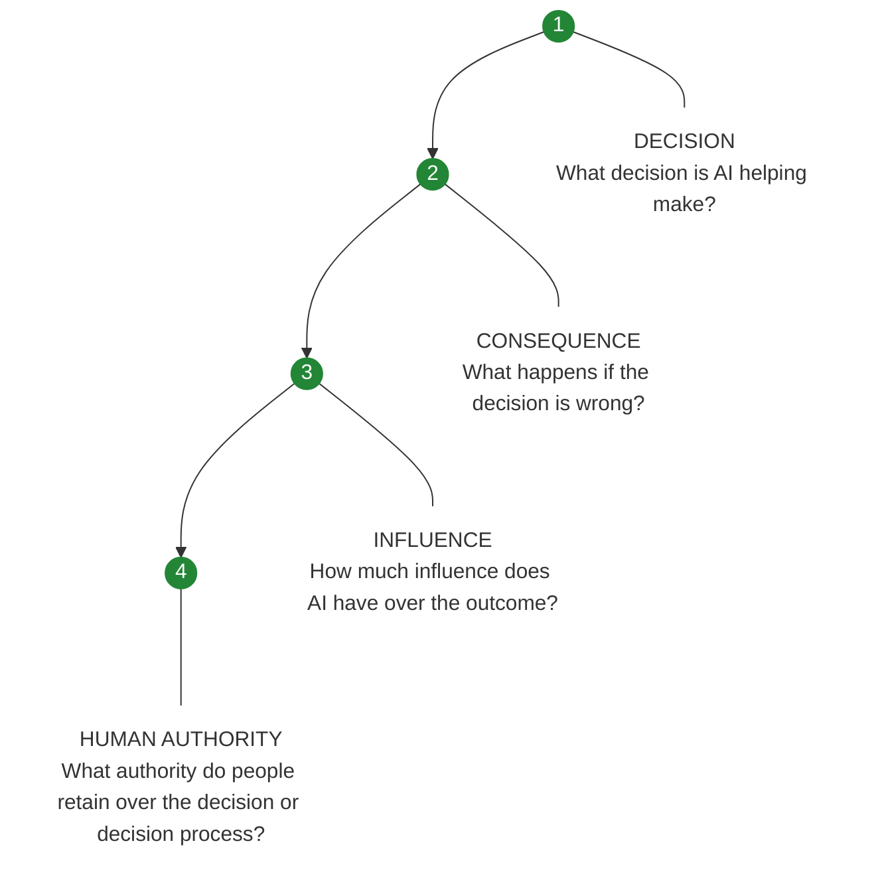

# AI Assisted Decision Accountability & Governance

> **Govern every decision AI helps shape.**

AADAG is a decision governance framework for understanding and governing how artificial intelligence influences consequential decisions.

It begins with four questions:

1. **What decision is AI helping us make?**
2. **How consequential is that decision if it is wrong?**
3. **How much influence does AI have over the outcome?**
4. **What human authority, basis, and accountability apply to the decision?**

These questions reveal how AI affects people, resources, rights, access, safety, and institutional outcomes.

## Decision Path

## Why this repository exists

AADAG applies principles from risk management, cybersecurity governance, and accountability to the decisions AI helps shape. This repository exists to develop AADAG in the open, test its concepts against real decisions, and provide organizations with a practical method for managing AI influence over consequential decisions.

## Decision consequence levels

AADAG v0.2 introduces a working consequence scale for classifying the potential impact of an incorrect AI influenced decision:

- **CU: Undetermined**
- **C0: Negligible**
- **C1: Limited**
- **C2: Moderate**
- **C3: Significant**
- **C4: Critical**

Full definitions are maintained in the [Framework](FRAMEWORK.md). The level names, definitions, assignment rules, practical examples, and known limitations are established as the current v0.2 working consequence model.

## Worked example

A privileged-access decision shows the Decision Path in practice:

> **Privileged production access → C3 Significant → Recommend → Human approval**

An AI system evaluates an employee's role, requested permissions, manager authorization, existing access, and applicable policy, then recommends whether privileged administrator access should be granted. A designated human approver retains authority to accept, reject, or modify the recommendation.

The full nine-field Decision Inventory captures the affected parties, decision owner, authorizing authority, basis, and review or recourse. See the [v0.2 Validation Record](TESTING.md) for the complete pressure test.

## Alignment with the NIST AI Risk Management Framework

AADAG is designed to align with the principles of the **NIST Artificial Intelligence Risk Management Framework (AI RMF 1.0)** and its four core functions:

**GOVERN:** Establish governance, accountability, policies, and responsibilities for managing AI risk.

**MAP:** Establish the context in which AI is used and identify potential risks and impacts.

**MEASURE:** Assess, test, and monitor identified AI risks using appropriate qualitative and quantitative methods.

**MANAGE:** Prioritize identified risks and implement, monitor, and adjust risk treatments.

AADAG applies these principles at the decision level through a simple governance path:

> **Decision → Consequence → Influence → Human Authority**

**Decision:** What decision is AI helping make?

**Consequence:** What happens if that decision is wrong?

**Influence:** How much influence does AI have over the outcome?

**Human Authority:** What authority do people retain over the decision or decision process?

This decision path provides context for applying the NIST AI RMF functions. AADAG identifies the decision being governed, its potential consequences, the influence given to AI, and the human authority retained over the decision or decision process.

A more detailed **NIST AI RMF 1.0 crosswalk and use case** is planned as the framework develops.

**Reference:** National Institute of Standards and Technology, [Artificial Intelligence Risk Management Framework (AI RMF 1.0)](https://www.nist.gov/publications/artificial-intelligence-risk-management-framework-ai-rmf-10)

## Delegation and accountability

AADAG defines **delegation** as the organizational authorization granting AI a defined level of influence over a decision.

Influence describes what AI is authorized to do. Delegation identifies the organizational authority that authorized it. Delegation is incorporated as an accountability mechanism rather than a separate scoring dimension.

The authority granting or changing AI's influence over a decision should be identifiable and documented.

## Start here

- [Framework](FRAMEWORK.md)
- [Validation Record](TESTING.md)
- [Principles](PRINCIPLES.md)
- [Roadmap](ROADMAP.md)
- [Traceability](TRACEABILITY.md)
- [Contributing](CONTRIBUTING.md)
- [Changelog](CHANGELOG.md)

## Current status

- **Version:** 0.2 Decision Classification
- **Status:** Released September 22, 2026
- **Completed:** Consequence model, AI influence model, delegation accountability mechanism, Decision Path, nine-field Decision Inventory, initial NIST AI RMF 1.0 alignment, and end-to-end validation
- **Next:** v0.3 Safeguard Mapping
- **Maintainer:** Gray Beard Governance

## Short description

AADAG helps organizations identify and classify the decisions AI influences, document human authority and accountability, and assess potential consequences and AI influence.

## Feedback

Constructive challenges are welcome. If a concept is unclear, incomplete, difficult to apply, or produces the wrong result, please open an issue.
